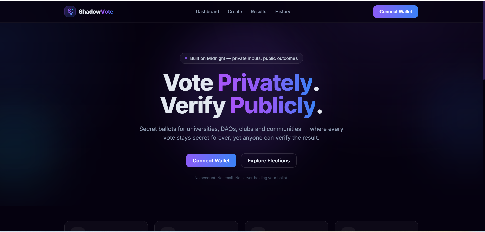
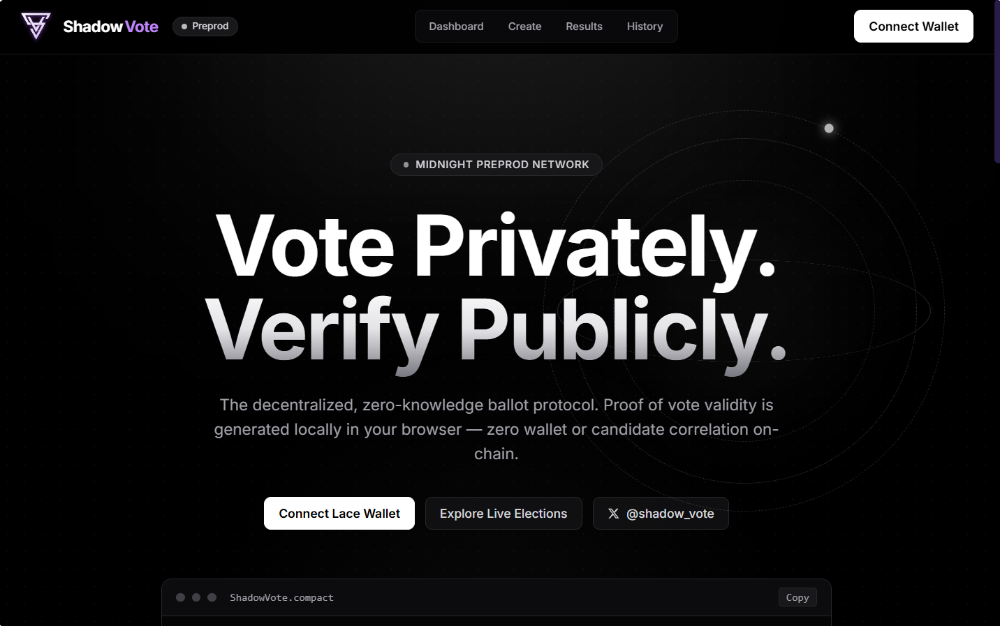
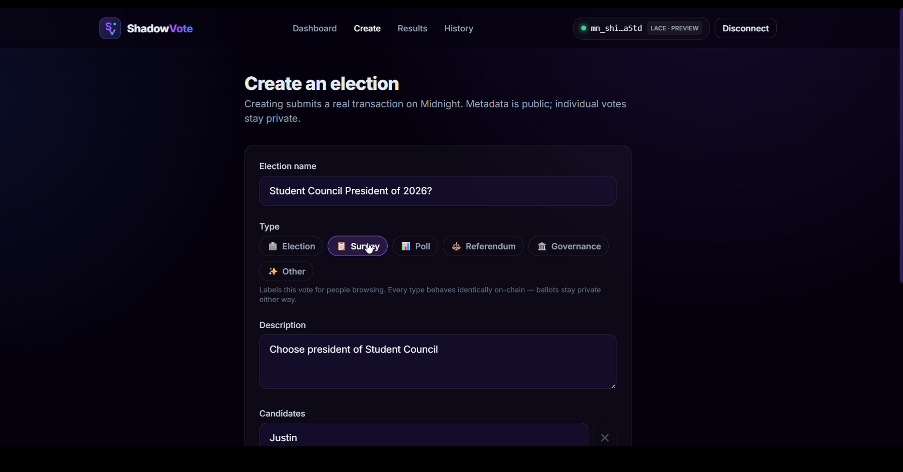
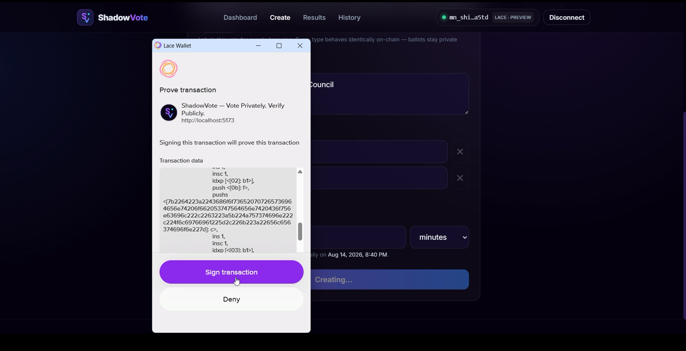
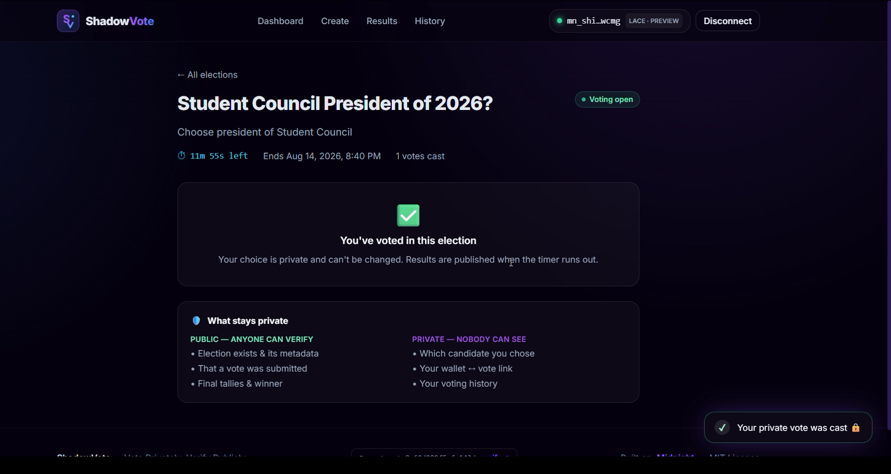
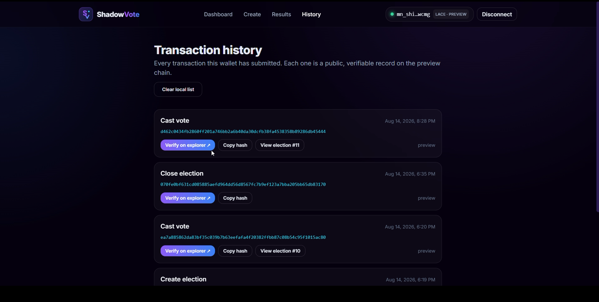

<div align="center">

# 🗳️ ShadowVote

### Vote Privately. Verify Publicly.

Privacy-first decentralized voting on the **Midnight** blockchain.

<!-- Replace OWNER/REPO with your GitHub path once the repo is pushed. -->
[](https://github.com/OWNER/REPO/actions/workflows/ci.yml)

</div>

> A Compact smart contract for secret-ballot elections: your candidate choice is
> a private witness that never touches the chain, while the tally and the winner
> are fully public and independently verifiable.

---

## Live Demo

<!-- TODO: paste the URL after deploying to Vercel or Netlify -->

_[PLACEHOLDER — deploy the frontend and paste the live URL here]_

Locally: `npm run dev` → <http://localhost:5173>

---

## Contract Address

| Network | Address |
|---------|---------|
| **Preview** | `8e60d089f565d4aef839646e8c8c5443ff0f57f2d999e278fc714c2c7efc143d` |
| Preprod | _not deployed — see note below_ |

**Verify it yourself** (no wallet, no trust required):

- Explorer: <https://explorer.preview.midnight.network/contracts/8e60d089f565d4aef839646e8c8c5443ff0f57f2d999e278fc714c2c7efc143d>
- Indexer (GraphQL): `https://indexer.preview.midnight.network/api/v3/graphql`

```graphql
query {
  contract(address: "8e60d089f565d4aef839646e8c8c5443ff0f57f2d999e278fc714c2c7efc143d") {
    address
    state
  }
}
```

Deployed 2026-08-14 at block **411008**. Live elections and votes have been cast
against it — for example `createElection` at block 411546 and `castVote` at
411550, both `SUCCESS`.

> **On Preprod:** deployment is blocked by the preprod faucet, which is gated
> behind a Cloudflare Turnstile challenge that currently fails to issue tNIGHT.
> Level 1 accepts **Preview *or* Preprod**, and the Preview deployment above is
> live and verifiable.

---

## What This Does

ShadowVote runs elections where **nobody can see how you voted — not the
organizer, not other voters, not anyone reading the chain — yet everyone can
verify the result is correct.**

A single contract manages many elections. Anyone with a wallet can create one
(name, description, candidates, deadline) and anyone can vote in it exactly once.
Vote counts accumulate publicly, but the link between a voter and their choice
is never written down anywhere.

The problem it solves: on ordinary public blockchains every vote is readable
forever, so wallet history reveals political preference. Universities, DAOs,
clubs and communities need **secret ballots**, which a transparent ledger cannot
provide on its own.

---

## Privacy Model

**What is PUBLIC (on-chain, visible to anyone):**

- Election id, name, description, candidate count, deadline, status
- Per-candidate vote tallies and total turnout
- The organizer's *commitment* — a hash, not an address
- One opaque **nullifier** per voter per election

**What is PRIVATE (private witness, never on-chain):**

- The voter's secret key — supplied by the `localSecretKey()` witness, it lives
  only in the prover and in browser-local private state
- **Which candidate the voter chose** — a private circuit input
- Any link between a wallet address and a ballot

**What the user PROVES without revealing:**

> *"I am eligible, I have not already voted in this election, and my vote is for
> a valid candidate"* — without revealing **who they are** or **who they voted
> for**.

The mechanism: on-chain a voter appears only as

```
nullifier = hash("shadowvote:nul", electionId, secretKey)
```

That value is deterministic per (election, voter), so a second vote is rejected —
but it is unlinkable to the wallet, and it is a **different** value in every
election, so ballots cannot be correlated across elections.

Compact makes this the default: circuit inputs are private unless deliberately
disclosed. `castVote` calls `disclose()` on exactly two things — the election id
and the candidate index — because both must reach public ledger state to
increment the right tally. The secret key is never disclosed; only the nullifier
*derived* from it is.

**Sealed tallies.** Per-candidate counts stay withheld until the deadline. A
live running count pressures late voters and, in a small election, can
de-anonymise them by differencing consecutive reads. Turnout is public
throughout, because it leaks nothing about choices.

---

## Privacy Claim

> **A voter can prove they cast a valid, unique vote without revealing which
> candidate they chose.**

**What an on-chain observer CAN see:**

| | |
|---|---|
| The election | id, name, description, candidate count, deadline, status |
| That a vote happened | turnout increments; a transaction exists in a block |
| The outcome | per-candidate tallies and the winner, once closed |
| A nullifier | a 32-byte value proving *someone* eligible voted, once |
| The organizer | a hash commitment — not an address |

**What an on-chain observer CANNOT see:**

| | |
|---|---|
| The choice | which candidate any given vote was for |
| The voter | which wallet cast which ballot |
| The link | any mapping from a nullifier to a candidate — it does not exist in the ledger |
| The history | whether the same person voted in two different elections |
| The secret | the voter's secret key, which never leaves the prover |

**Why the link cannot be reconstructed.** `castVote` writes exactly two things:
`voted.insert(nullifier)` and `tallies.insert(tallyKey(electionId, candidateIndex), n+1)`.
These are separate ledger entries with no shared key. The nullifier derives from
`hash("shadowvote:nul", electionId, secretKey)` — it contains no candidate
information — and the tally key derives from the candidate index — it contains
no voter information. Correlating them would require inverting a hash.

Because the nullifier includes the election id, the *same* voter produces a
*different* nullifier in every election, so ballots cannot be linked across
elections either. This is asserted directly in the test suite.

---

## Tech Stack

- **Blockchain:** Midnight (Preview network)
- **Contract language:** Compact `0.23`, compiler `0.31.1`
- **Runtime:** Node.js 22+, Docker (proof server)
- **SDK:** `@midnight-ntwrk/midnight-js` 4.1.1, `compact-runtime` 0.16.0, `ledger-v8`
- **Wallet:** Lace (Midnight-enabled), via the DApp connector API v4
- **Frontend:** React 18, Vite 5, TypeScript, TailwindCSS, Framer Motion
- **Tests:** Vitest, driving the compiled contract through the compact-runtime simulator
- **CI:** GitHub Actions
- **Backend:** none — all state lives on Midnight

---

## Prerequisites

| Requirement | Notes |
|---|---|
| **Node.js 22+** | `node --version` |
| **Docker** | Required to run the proof server |
| **Compact compiler** | `compact --version` — install below |
| **Lace wallet** | Midnight-enabled browser extension, set to **Preview** |
| **tNIGHT on Preview** | From the Preview faucet, then *registered for DUST generation* in Lace |

> ⚠️ **The Compact toolchain runs on Linux/macOS.** On Windows use **WSL2
> (Ubuntu)** + Docker Desktop. The repo can live on your Windows drive and is
> reachable from WSL at `/mnt/c/...`.

> 💡 **Fees are paid in DUST, which NIGHT generates only after you register it.**
> Holding tNIGHT alone is not enough — register it for DUST generation in Lace
> and wait for it to accrue, or every transaction will fail to balance.

---

## Setup

```bash
# 1. Clone and install (npm workspaces — installs contract + frontend)
git clone <your-repo-url> shadowvote
cd shadowvote
npm install

# 2. Install the Compact compiler (Linux / macOS / WSL)
sudo apt-get update && sudo apt-get install -y unzip   # `compact update` unzips
curl --proto '=https' --tlsv1.2 -LsSf \
  https://github.com/midnightntwrk/compact/releases/latest/download/compact-installer.sh | sh
source ~/.bashrc && compact update && compact --version

# 3. Compile the contract -> contract/managed/shadowvote
npm run compile

# 4. Start the proof server (Docker must be running)
docker run -d -p 6300:6300 --name shadowvote-proof \
  midnightntwrk/proof-server:latest midnight-proof-server -v

# 5. Run the dApp
npm run dev            # http://localhost:5173
```

Then open <http://localhost:5173>, connect Lace (on **Preview**), and the app
joins the deployed contract automatically — joining is free and submits no
transaction.

**A real wallet is required.** There is no demo or offline fallback: every
address and every hash you see is real. Wallets inject themselves into
`window.midnight` under a freshly generated UUID key, so the app enumerates
`Object.entries(window.midnight)` rather than looking for a fixed name.

---

## Run Tests

```bash
npm test --workspace contract
```

Requires `npm run compile` first — the tests import the generated
`contract/managed/shadowvote`, which is not checked in.

**6 tests**, all driving the real compiled contract through the compact-runtime
simulator (no mocks):

| Test | Proves |
|---|---|
| Creates an election, returns a monotonic id | Circuit logic + ledger writes |
| Rejects fewer than two candidates | Input validation |
| Prevents the same voter voting twice | Nullifier state transition |
| Rejects an out-of-range candidate index | Bounds checking |
| **Keeps the voter→candidate link private** | **Private inputs never exposed** |
| Only the organizer can close an election | Authorization + closed-state transition |

The privacy test asserts the ledger contains exactly two opaque nullifiers and
**no mapping from any nullifier to a candidate index**, that the same voter
produces a *different* nullifier in a different election, and that the raw secret
key appears nowhere in public state.

---

## CI/CD

GitHub Actions runs on every push to `main` and every pull request
(`.github/workflows/ci.yml`), in two parallel jobs:

**`contract`** — installs the Compact toolchain, installs dependencies once at
the workspace root, runs `compact compile` to generate `managed/shadowvote`,
then runs the Vitest suite against the freshly compiled contract. Because
`managed/` is generated and gitignored, compiling first is required rather than
merely tidy.

**`frontend`** — runs `tsc -b && vite build`, so any type error fails the build.

Both pin Node 22 with npm caching. Installing at the workspace root is
deliberate: `npm install` inside a workspace child links binaries
inconsistently, which is exactly how this repo once ended up with an orphaned
`tsc` shim that broke the build.

---

## Usage Guide

See **[docs/USAGE.md](docs/USAGE.md)** — a plain-English walkthrough for
non-technical users, including the DUST registration step that most people miss.

---

## Product Proposal

See **[PROPOSAL.md](PROPOSAL.md)**.

---

## Initial Idea

<!-- TODO: fill this in manually before submitting on Rise In -->

_[PLACEHOLDER — add your approved idea from the provided idea list here]_

---

## Screenshots

A full run through the app, in order.

### 1. Landing



The privacy claim up front — *Vote Privately. Verify Publicly.* No account, no
email, no server holding a ballot.

### 2. Wallet connected



Lace connected on **Preview** (`LACE · PREVIEW`), with the address shown and a
**Disconnect** button. Live counts read straight from the public ledger:
10 elections, 8 votes cast.

### 3. Creating a vote



Name, type (election / survey / poll / referendum / governance / other),
description, candidates and a voting window. The form states plainly that
metadata is public while individual votes stay private.

### 4. Signing in Lace — the proof



Lace's **Prove transaction** prompt. The proof is generated locally in the
browser first; the wallet then signs it. The transaction data visible here is
the *proof and public inputs* — **the chosen candidate is not among them.**

### 5. Vote cast — privacy stated



*"You've voted in this election — your choice is private and can't be changed."*
The panel spells out both halves side by side: what anyone can verify (the
election, that a vote happened, the final tally) versus what nobody can see
(which candidate, the wallet↔vote link, voting history).

### 6. Verifiable history



Every transaction this wallet has submitted, each with a real hash and a
**Verify on explorer ↗** link. Don't trust the app — check the chain.

<!-- TODO (optional): add a screenshot of `compact compile` output and the
     terminal showing the test suite passing. -->


---

## Demo Video

<!-- TODO: paste the link after recording -->

_[PLACEHOLDER — add the demo video link]_

---

## Product X Profile

<!-- TODO: paste the link after creating the account -->

_[PLACEHOLDER — add the product X profile link]_

---

## Project Structure

```
shadowvote/
├── contract/                        # the Compact contract (whole backend)
│   ├── src/
│   │   ├── ShadowVote.compact       # ← the contract
│   │   └── witnesses.ts             # private-state / secret-key provider
│   ├── tests/
│   │   └── shadowvote.test.ts       # ← test suite
│   └── managed/                     # ← generated by `compact compile`
├── frontend/                        # React + Vite dApp
│   └── src/{components,pages,hooks,lib}
├── .github/workflows/ci.yml         # CI: compile + test contract, build frontend
├── README.md
└── package.json                     # npm workspaces
```

> **Mapping to the Level 1 reference layout:** this project is an npm-workspaces
> monorepo rather than the flat template, because the frontend and contract are
> separate packages with different toolchains. `contracts/` → `contract/src/`,
> `tests/` → `contract/tests/`, `src/` → `frontend/src/`; `managed/`,
> `.github/workflows/`, `README.md` and `package.json` are as specified.

---

## How It Works

```
Anyone with a wallet creates an election (+ its voting deadline)
        ↓
Voter connects Lace wallet  →  app joins the contract (free, no transaction)
        ↓
Contract checks the nullifier (already voted?)
        ↓ (if not)
Private vote submitted as a ZK proof
        ↓
Per-candidate tally increments — voter link never recorded
        ↓
Organizer closes the election → results become public
```

**Open participation:** any connected wallet can create an election and any
wallet can vote in it once, enforced by the per-election nullifier. Only the
creating wallet can close its own election, since closing publishes the tally —
the contract asserts `organizers.lookup(id) == organizerKey(localSecretKey())`.

Contract entry points: `createElection`, `castVote`, `closeElection`,
`getCandidateVotes`, `hasVoted`, plus helper circuits `organizerKey`,
`nullifier`, `tallyKey`.

---

## Deploy Your Own

The supported path is **from the browser, via your own wallet**:

1. Connect Lace on Preview with tNIGHT registered for DUST generation
2. Open the app and choose **Deploy a new contract**
3. Approve the transaction — this submits a real transaction and costs a fee
4. Add the printed address to `CONTRACTS` in `frontend/src/lib/chainSession.ts`

Contract addresses are keyed by network there, so Preview and Preprod
deployments can coexist and the app picks whichever matches the connected
wallet. A build-time `VITE_SHADOWVOTE_CONTRACT_ADDRESS` overrides both.

---

## Roadmap

DAO integration · anonymous polls · role-based organizers · election analytics ·
delegated voting · NFT voting badges · mobile app · mainnet deployment.

---

## License

MIT
