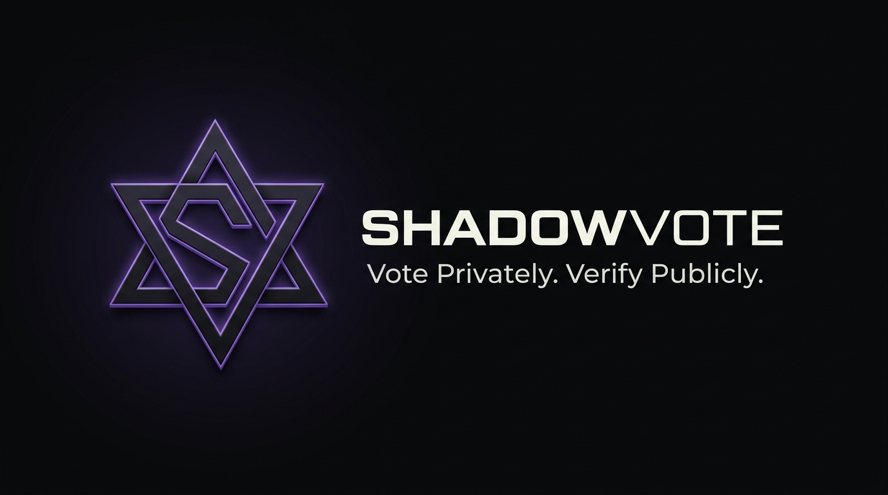
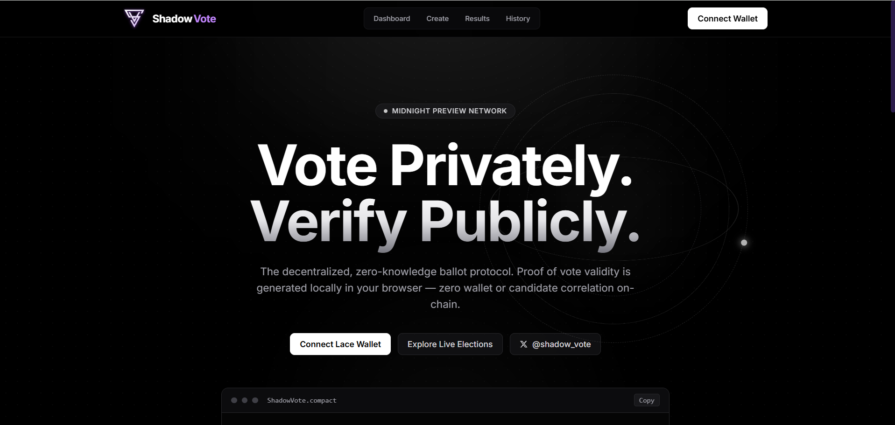
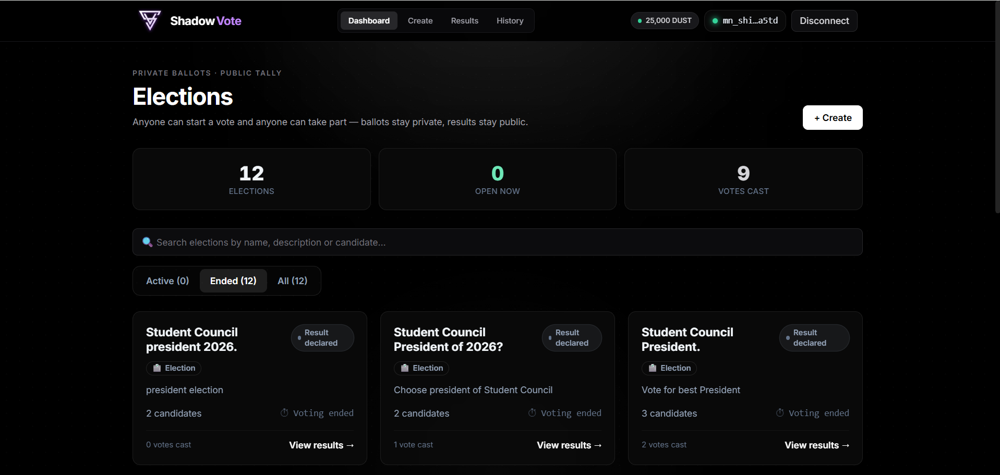
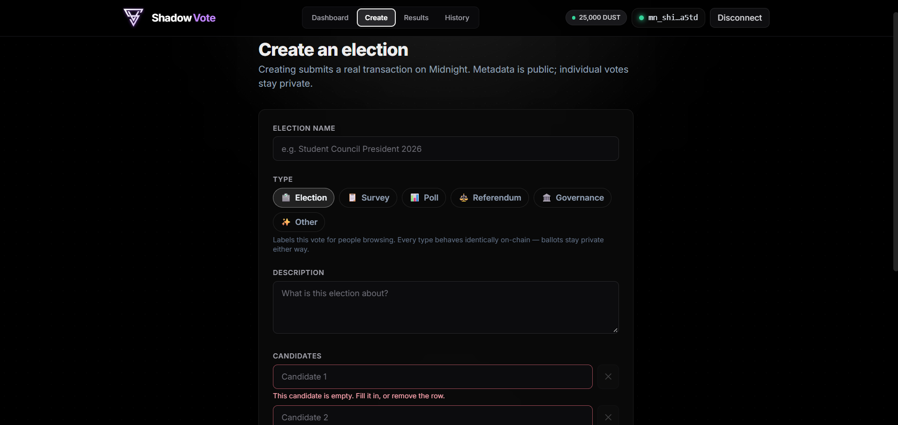
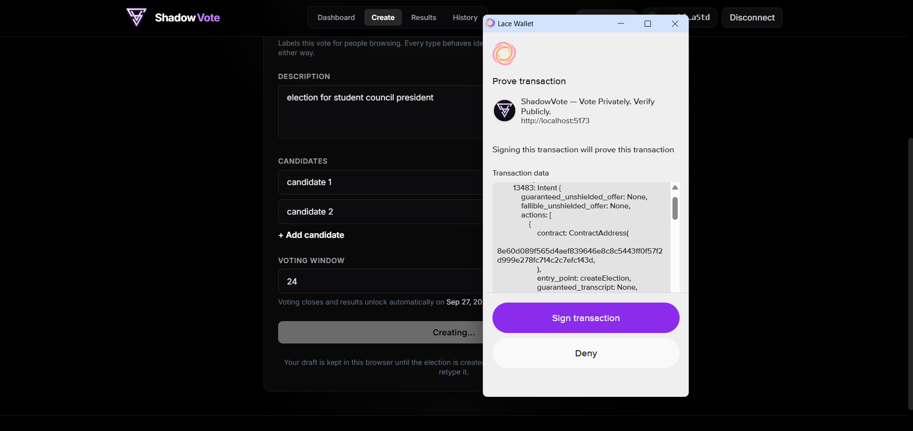
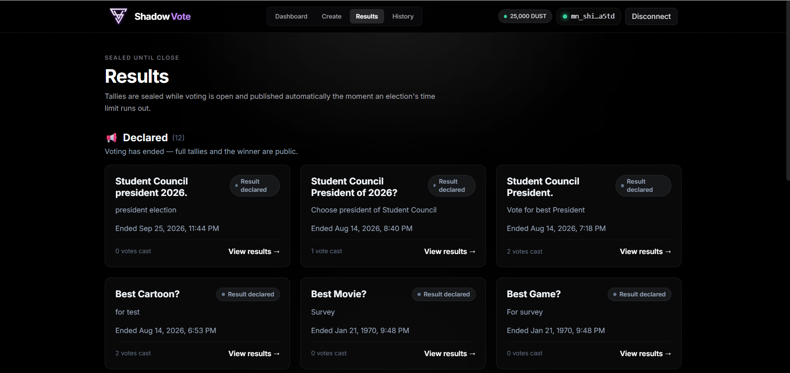
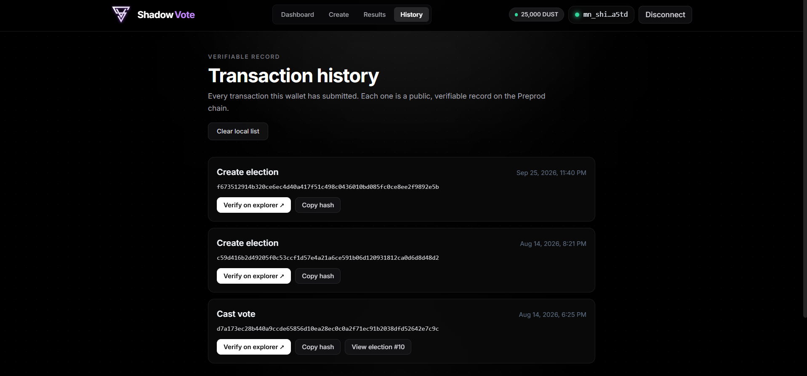

<div align="center">
  
  <h1>ShadowVote — Private Ballot Voting on Midnight</h1>
  <p><b>Secret ballots on a public blockchain, built on Midnight.</b></p>
  <p>
    <a href="https://github.com/Vivek-Alpha06/ShadowVote/actions/workflows/ci.yml"></a>
    <a href="https://github.com/Vivek-Alpha06/ShadowVote/actions"></a>
    <a href="./USERS.md"></a>
    <a href="https://docs.google.com/spreadsheets/d/1B07RbJPFne3YGf0twpKOITEtx5-G8XfZfREDKx7xvT4/edit?gid=897452887#gid=897452887"></a>
    <a href="#-verified-midnight-preprod-contract"></a>
    <a href="./contract/src/ShadowVote.compact"></a>
    <a href="./LICENSE"></a>
  </p>
</div>

## 📝 Project Description

ShadowVote is a privacy-preserving elections protocol built on the **Midnight** blockchain for the **Midnight Builder Challenge**. It runs elections where nobody can see how you voted — not the organizer, not other voters, not anyone reading the chain — yet everybody can verify the result is correct.

A single contract manages many elections. Anyone with a wallet can create one (name, description, candidates, deadline) and anyone can vote in it exactly once. Vote counts accumulate as public ledger state, but the link between a voter and their choice is never written down anywhere — not encrypted, not access-controlled, simply never recorded.

The problem it solves: on an ordinary public blockchain a secret ballot is impossible. Every transaction is readable forever, so wallet history reveals political preference and coercion becomes trivial. Universities, DAOs, clubs, and unions need secret ballots, which a transparent ledger cannot provide on its own. Midnight's separation of public ledger state from private witnesses is what makes it possible to prove a ballot is valid and unique **without** revealing the ballot.

---

## 🌐 Project Deliverables & Key Links

| Deliverable Resource | Direct Verification Link | Description / Details |
| :--- | :--- | :--- |
| 🚀 **Live Web Application** | [https://shadow-vote-frontend-one.vercel.app](https://shadow-vote-frontend-one.vercel.app/) | Production ShadowVote dApp running against Midnight Preprod |
| ⚡ **Preprod Contract** | [`8e60d089…c143d` on Midnight Explorer](https://explorer.preview.midnight.network/contracts/8e60d089f565d4aef839646e8c8c5443ff0f57f2d999e278fc714c2c7efc143d) | Verifiable Compact contract address on Midnight Preprod |
| 📺 **YouTube Walkthrough Demo** | [Watch Demo Video](https://youtu.be/F7ObiswjYpo) | Full video walkthrough of the ShadowVote MVP |
| 📊 **User Feedback Sheet** | [View Feedback Sheet](https://docs.google.com/spreadsheets/d/1B07RbJPFne3YGf0twpKOITEtx5-G8XfZfREDKx7xvT4/edit?gid=897452887#gid=897452887) | All **80 verified responses** — name, wallet, rating, free-text feedback |
| 📝 **User Feedback Form** | [Submit Feedback](https://docs.google.com/forms/d/1McCwyY8gsHOxkFK3IasCRYNmYI_OMeXqolxa9JibAGY/viewform) | Google Form collector — wallet address, rating, what was tried, what confused you |
| 📈 **Feedback Log & Iterations** | [docs/FEEDBACK.md](./docs/FEEDBACK.md) | Statistics, themes, raw log, and the 14 changes shipped because of it |
| 👥 **Level 5 Preprod Users** | [USERS.md](./USERS.md) | **50 / 50** — name, full wallet address and date, all verifiable on-chain |
| 🌕 **Level 6 Preprod Users** | [LAUNCH_USERS.md](./LAUNCH_USERS.md) | **30 / 30** launch cohort — **80 unique Preprod users** across both |
| 📖 **User Guide** | [docs/USAGE.md](./docs/USAGE.md) | Plain-English walkthrough — Getting Started on Preprod, Your First Transaction |
| 📣 **Outreach & Onboarding Kit** | [docs/OUTREACH.md](./docs/OUTREACH.md) | Discord/X/DM copy, 16-step onboarding script, demo video checklist |
| 🐤 **Product X (Twitter) Profile** | [@shadow_vote](https://x.com/shadow_vote) | Launch posts, demo clips, and tester call-outs |
| 🎨 **Brand Assets & Brief** | [logo/](./logo/) · [docs/BRAND.md](./docs/BRAND.md) | Primary mark, banner and minimal mark, plus tagline, key messages, palette and X bio |
| 📜 **Product Proposal** | [PROPOSAL.md](./PROPOSAL.md) | Product thesis, data model, and the known gaps stated plainly |
| ⚙️ **CI/CD Pipeline** | [View live workflow runs](https://github.com/Vivek-Alpha06/ShadowVote/actions/workflows/ci.yml) | Two-job GitHub Actions pipeline on every push — contract (Compact compile, ZK asset verification, 6 Vitest specs) and frontend (type-check + Vite build) |
| 🧾 **Contract Source** | [`ShadowVote.compact`](./contract/src/ShadowVote.compact) | 8 exported circuits, 10 public ledger fields, 1 private witness |

---

## 🗳️ Core Voting Mechanics

- **Secret Ballot, Public Tally:** Per-candidate counts, turnout, deadlines and status are public ledger state anyone can read on the explorer. Which candidate a given wallet chose is a private circuit input that never touches the chain.
- **Nullifier-Based Double-Vote Prevention:** Each voter appears on-chain only as `hash("shadowvote:nul", electionId, secretKey)` — identical if they vote twice in the *same* election (so the second attempt is rejected by the contract), completely different in every *other* election (so ballots cannot be linked across votes, and no nullifier walks back to a wallet).
- **Sealed Results Until Close:** Per-candidate tallies stay hidden while voting is open, because a live running count pressures late voters and, in a small election, can expose them by comparing readings. Only the organizer's wallet can close an election, and closing is what publishes the result.
- **Browser-Side Proving:** The zero-knowledge proof is generated on the voter's own machine. The voter secret comes from the `localSecretKey()` witness and never leaves the prover.
- **Free, Wallet-less Reads:** Every election, tally and result is readable with no wallet, no tokens and no signature — so anyone can audit an election without participating in it.

---

## 📸 Screenshots & Submission Proofs

### 1. Landing Page
The entry point: the privacy guarantee stated plainly, with the Compact circuit that
enforces it shown rather than described.



### 2. Elections Dashboard
Every election on one contract, filterable by status and type. Readable with no
wallet connected — public auditing costs nothing.



### 3. Creating an Election
Name, description, candidate set, type and voting window. The organizer is recorded
as a key *commitment*, never as a wallet address.



### 4. Casting a Private Ballot
The proof is generated locally in the browser. The candidate choice never leaves the
device — only a zero-knowledge proof that the choice was valid does.



### 5. Results — Sealed Until Close
Tallies stay hidden while voting is open and publish automatically the moment the
deadline passes, which removes the bandwagon effect from live on-chain counts.



### 6. On-Chain Transaction History & Explorer Verification
Every transaction this wallet submitted, each with a **Verify on explorer ↗** link.
A privacy product that asks you to take its word for things has missed the point.



---

## 🚀 Key Features

*   **Many Elections, One Contract:** A single deployed contract manages an unbounded number of elections, each with its own metadata, candidate set, deadline and independent tally.
*   **Zero-Knowledge Ballots:** Casting a vote proves three statements at once — you hold a valid voter secret, you have not already voted here, and your pick is a real candidate — while revealing none of them.
*   **Unlinkable Nullifiers:** One opaque nullifier per voter per election. Enforces one-person-one-vote without a registry of who is allowed to vote and without any organizer who has to be trusted to forget.
*   **Organizer Commitment, Not Address:** An election records a *hash* of the organizer's key, not their wallet, so closing rights are enforceable without publishing who runs the election.
*   **Sealed Tallies During Voting:** Results stay hidden until close, removing the bandwagon and late-voter-exposure problems that plague live on-chain counts.
*   **Explorer Verification Built Into the UI:** Every transaction in the **History** view carries a **Verify on explorer ↗** link. A privacy product that asks you to take its word for things has missed the point.
*   **Free Public Auditing:** Elections, tallies and results are readable with no wallet connected at all.
*   **Election Types:** Election, survey, poll, referendum and governance presets, with filtering by *Active* / *Ended*.

---

## 🔐 Privacy Model

| Data Point | Where It Lives | Visible To |
| :--- | :--- | :--- |
| Election id, name, description, candidate count, deadline, status | Public ledger | Everyone |
| Per-candidate tallies and total turnout | Public ledger | Everyone (tallies sealed until close) |
| Organizer commitment (a hash, **not** an address) | Public ledger | Everyone |
| One opaque nullifier per voter per election | Public ledger | Everyone — unlinkable to any wallet |
| **The voter's secret key** | Private witness (`localSecretKey()`) | **No one** — never leaves the prover |
| **Which candidate the voter chose** | Private circuit input | **No one** |
| **The link between a wallet and a ballot** | Never recorded anywhere | **No one** |

**What the user PROVES without revealing:**

> *"I am eligible, I have not already voted in this election, and my vote is for a valid candidate"* — without revealing who they are or who they voted for.

**Why the nullifier is the load-bearing piece.** It is the same value every time *you* vote in *this* election, so a second ballot is caught by the contract itself. It is a completely different value in every other election, so your ballots cannot be joined together across votes. And it is a one-way hash, so it cannot be traced back to your wallet. That single construction is what buys one-person-one-vote without an identity registry.

---

## ⚡ Verified Midnight Preprod Contract

ShadowVote is deployed and independently verifiable on **Midnight Preprod**:

| Component | Address / Value | Status | Verification Link |
| :--- | :--- | :---: | :--- |
| 🗳️ **ShadowVote Contract** | `8e60d089f565d4aef839646e8c8c5443ff0f57f2d999e278fc714c2c7efc143d` | 🟢 Live | [Midnight Explorer](https://explorer.preview.midnight.network/contracts/8e60d089f565d4aef839646e8c8c5443ff0f57f2d999e278fc714c2c7efc143d) |
| 🌐 **Network** | Midnight **Preprod** | 🟢 Active | [explorer.preprod.midnight.network](https://explorer.preprod.midnight.network) |
| 📦 **Compiled Artifacts** | [`contract/managed/shadowvote/`](./contract/managed/shadowvote/) | 🟢 Committed | contract · keys · zkir · compiler output |
| 🔑 **Browser Prover Assets** | [`frontend/public/midnight/shadowvote/`](./frontend/public/midnight/shadowvote/) | 🟢 Served | ZK keys and zkir shipped to the client prover |
| 🧬 **Contract Source** | [`ShadowVote.compact`](./contract/src/ShadowVote.compact) | 🟢 Open source | Compact `0.23`, compiler `0.31.1` |
| 🔗 **Frontend Binding** | [`chainSession.ts`](./frontend/src/lib/chainSession.ts) | 🟢 Wired | `CONTRACTS.preprod` — the address the live app attaches to |

### 🔍 Preprod Ledger Details

* **Contract Language:** Compact `pragma language_version 0.23`, compiler `0.31.1`
* **Exported Circuits:** `createElection` · `castVote` · `closeElection` · `nullifier` · `organizerKey` · `tallyKey` · `getCandidateVotes` · `hasVoted`
* **Public Ledger Fields:** `electionCount`, `names`, `descriptions`, `candidateCounts`, `endTimes`, `statuses`, `organizers`, `totalVotes`, `tallies`, `voted`
* **Private Witness:** `localSecretKey(): Bytes<32>`
* **Explorer Base:** `https://explorer.preprod.midnight.network`

### ✅ Verify the Address Yourself

A contract id in a README proves nothing on its own, and a stale one fails **silently** — the app simply reads a different contract instead of erroring. Check it against the live ledger:

```bash
# 1. The contract exists on Preprod (a 200 is meaningful — the explorer
#    genuinely 404s unknown routes, it is not a catch-all).
curl -s -o /dev/null -w "%{http_code}\n" \
  https://explorer.preprod.midnight.network/contracts/8e60d089f565d4aef839646e8c8c5443ff0f57f2d999e278fc714c2c7efc143d

# 2. The address in this README is the same one the live frontend attaches to.
grep -n "preprod" frontend/src/lib/chainSession.ts
```

Then open the [live app](https://shadow-vote-frontend-one.vercel.app/) with Lace set to **Preprod** and confirm the contract shown in the footer matches the table above.

> ⚠️ **Network matters.** A contract only exists on the network it was deployed to. A wallet pointed anywhere other than Preprod will load the app and show an **empty election list with no error**. If the app looks broken, check the network selector in Lace first.

---

## 🟢 Level 5: User Validation Deliverables

### 1. Preprod Deployment & Public Application
* **Preprod Contract:** `8e60d089f565d4aef839646e8c8c5443ff0f57f2d999e278fc714c2c7efc143d`
* **Live Application:** [https://shadow-vote-frontend-one.vercel.app](https://shadow-vote-frontend-one.vercel.app/)
* **Demo Video:** [MVP walkthrough on YouTube](https://youtu.be/F7ObiswjYpo)

### 2. Verified Preprod User Interactions

**50 distinct Preprod wallets onboarded — 50 / 50, target met.**

The roster lives in [`USERS.md`](./USERS.md) rather than being duplicated here, with a name, a **full** `mn_addr_preprod1…` address and an onboarding date for every row. A row is only added once **both** are true:

1. The person sent their own Midnight Preprod address (`mn_addr_…`), **and**
2. They actually used the live app — created an election, cast a vote, or closed one — so their activity is visible on-chain against the contract above.

> **What listing a wallet does and does not prove.** It records that the wallet **participated**. It cannot record **how it voted** — that link is never written down, on-chain or off. This is the one metric the product is structurally incapable of inflating with fake engagement, and equally incapable of using to profile anyone.

### 3. Feedback Collection Loop

**80 verified responses · average rating 3.92 / 5.0 · 29 responses at 3 stars or below.**

| | |
| :--- | :--- |
| 📊 **Live feedback sheet** | [All 80 responses on Google Sheets](https://docs.google.com/spreadsheets/d/1B07RbJPFne3YGf0twpKOITEtx5-G8XfZfREDKx7xvT4/edit?gid=897452887#gid=897452887) |
| 📝 **Collector form** | [Google Form](https://docs.google.com/forms/d/1McCwyY8gsHOxkFK3IasCRYNmYI_OMeXqolxa9JibAGY/viewform) — name, wallet, rating, free-text |
| 📈 **Analysis** | [`docs/FEEDBACK.md`](./docs/FEEDBACK.md) — statistics, four themes, raw log |
| 🔒 **Tester privacy** | Responses live in the Sheet, not the repo. The raw export carries tester names and email addresses, and publishing those in a public repo would be indefensible for a privacy product. |

Feedback also arrived through Discord and Telegram builder channels, direct DMs to personally onboarded contacts, and replies on [@shadow_vote](https://x.com/shadow_vote).

Every response ties back to a wallet in `USERS.md` or `LAUNCH_USERS.md`. The 80 wallets in the sheet and the 80 wallets in the rosters match **exactly in both directions** — no response without a roster entry, no roster entry without a response — so each piece of feedback traces to a real on-chain Preprod participant.

**Rating distribution**

| Rating | Responses | Share | What this band told us |
| :---: | :---: | :---: | :--- |
| ⭐⭐⭐⭐⭐ | 35 | 43.8% | Core privacy model, nullifier security, fast desktop proving |
| ⭐⭐⭐⭐ | 16 | 20.0% | Worked, but asked for search, export, share links, faucet help |
| ⭐⭐⭐ | 17 | 21.2% | Mobile touch targets, no export, results needed manual reloads |
| ⭐⭐ | 12 | 15.0% | Real bugs: mobile proof freeze, unhandled gas errors, wedged disconnect state |

**36% of responses were 3 stars or below.** Those 29 reports are where the
Level 6 work went — the two-star band in particular describes real defects,
not preferences, and every one of them is addressed in the table below.

### 4. Product Improvements Shipped From Feedback

**14 improvements shipped** in direct response to tester reports, each linked to its commit:

| # | Friction addressed | Implementation | Commit |
| :-: | :----------------- | :------------- | :----- |
| 1 | Silent ~25s proving phase read as a crashed tab (2⭐) | Five-stage progress checklist — checking → proving → signing → submitting → confirming | [`672b08d`](https://github.com/Vivek-Alpha06/ShadowVote/commit/672b08d) |
| 2 | A failed transaction threw the ballot away (2⭐) | Modal stays open with the selection intact and a **Try again** button | [`672b08d`](https://github.com/Vivek-Alpha06/ShadowVote/commit/672b08d) |
| 3 | Disconnecting mid-proof wedged the UI forever (2⭐) | Connection watched while submitting; resets to an actionable error | [`672b08d`](https://github.com/Vivek-Alpha06/ShadowVote/commit/672b08d) |
| 4 | Cryptic RPC error instead of "you need gas" (3⭐) | Faucet link in the connect panel and inside the error itself | [`2e2416f`](https://github.com/Vivek-Alpha06/ShadowVote/commit/2e2416f) |
| 5 | No way to check gas before starting a vote (4⭐) | Live DUST balance chip in the header, amber "get tokens" link at zero | [`2e2416f`](https://github.com/Vivek-Alpha06/ShadowVote/commit/2e2416f) |
| 6 | Blank candidate name wasted gas on-chain (2⭐) | Inline validation for blanks, duplicates, count and window, before any transaction is built | [`1a8c9ec`](https://github.com/Vivek-Alpha06/ShadowVote/commit/1a8c9ec) |
| 7 | A typo meant re-entering the whole form (2⭐) | Create form autosaves a draft, cleared only once the election exists | [`1a8c9ec`](https://github.com/Vivek-Alpha06/ShadowVote/commit/1a8c9ec) |
| 8 | No search in a long election list (4⭐) | Search across name, description and candidate names | [`cba3269`](https://github.com/Vivek-Alpha06/ShadowVote/commit/cba3269) |
| 9 | Mobile mis-taps selected the wrong candidate (3⭐) | 64px minimum rows, larger radio, wider gaps | [`cba3269`](https://github.com/Vivek-Alpha06/ShadowVote/commit/cba3269) |
| 10 | "Nullifier" meant nothing to non-technical voters (3⭐) | Defined in one line as an *anonymous voting ticket*, in place | [`cba3269`](https://github.com/Vivek-Alpha06/ShadowVote/commit/cba3269) |
| 11 | Organizers had to screenshot tallies (3⭐) | CSV export carrying contract address, election id and timestamp | [`56288f9`](https://github.com/Vivek-Alpha06/ShadowVote/commit/56288f9) |
| 12 | No easy way to share an election link (4⭐) | Copy-link buttons with a visible fallback when the clipboard is blocked | [`56288f9`](https://github.com/Vivek-Alpha06/ShadowVote/commit/56288f9) |
| 13 | Had to reload 3× before the tally appeared (3⭐) | Polls past the deadline until results reveal, instead of one refresh at T=0 | [`56288f9`](https://github.com/Vivek-Alpha06/ShadowVote/commit/56288f9) |
| 14 | Long candidate names were truncated (4⭐) | Names wrap instead of being cut off — the name is what is being voted on | [`cba3269`](https://github.com/Vivek-Alpha06/ShadowVote/commit/cba3269) |

Every commit message quotes the tester and star rating that prompted it, so
the link from complaint to fix is checkable in `git log` rather than asserted
here. Two further reports turned out to describe behaviour that already worked,
and three requests were deferred with reasons — both recorded in
[`docs/FEEDBACK.md`](./docs/FEEDBACK.md) rather than quietly dropped.

---

## 🟢 Level 6: Launch Deliverables

### 1. Updated Preprod Deployment
* Redeploy command: `npm --workspace contract run deploy`
* On redeploy, the address is updated in **three** places: the table above, `CONTRACTS.preprod` in [`chainSession.ts`](./frontend/src/lib/chainSession.ts), and [`docs/USAGE.md`](./docs/USAGE.md).

### 2. Launch Cohort — 30 Additional Users

**30 / 30 onboarded — 80 unique Preprod users across both cohorts.**

Roster: [`LAUNCH_USERS.md`](./LAUNCH_USERS.md), with a name, full wallet address and onboarding date per row. No wallet appears in both files — verified programmatically: 80 addresses, 80 unique, zero overlap — so 50 + 30 is a genuine 80 distinct users. Level 6 users were onboarded personally via the [16-step onboarding script](./docs/OUTREACH.md#level-6-onboarding-script) and asked for feedback on the *improved* build specifically, so their reports compare against the Level 5 baseline.

### 3. Feedback-Driven Improvements

The fourteen shipped changes are listed in the [Level 5 improvements table](#4-product-improvements-shipped-from-feedback) above and detailed in [`docs/FEEDBACK.md`](./docs/FEEDBACK.md), each tied to the tester, star rating and commit that produced it. Where a request was deferred rather than shipped, it is recorded as an answer, not quietly dropped.

### 4. Final Documentation
* [`docs/USAGE.md`](./docs/USAGE.md) — rewritten for launch with **Getting Started on Preprod** and **Your First Transaction**, in plain English for non-technical users.
* [`docs/OUTREACH.md`](./docs/OUTREACH.md) — outreach copy, onboarding script, and the demo video checklist.
* [`docs/BRAND.md`](./docs/BRAND.md) — brand brief, palette, X bio and banner concept.

### 5. Brand & Social Presence

The banner at the top of this README is the primary lockup; the marks below are the
rest of the system.

* **Tagline:** *Vote Privately. Verify Publicly.*
* **X Profile:** [@shadow_vote](https://x.com/shadow_vote)
* **Palette:** monochrome greyscale ink with a single Signal Violet `#8B5CF6` accent — full system in [`docs/BRAND.md`](./docs/BRAND.md).

**Brand assets**

| Asset | File | Use |
| :--- | :--- | :--- |
| 🔺 **Primary mark** | [`logo/shadowvote_logo.png`](./logo/shadowvote_logo.png) | Interlocking S/V monogram, white on near-black. X avatar, app icon, favicon source. |
| 🖼️ **Banner** | [`logo/shadowvote_banner.jpg`](./logo/shadowvote_banner.jpg) | 1920×1080 wordmark lockup with tagline. README hero, social cards. |
| ◼️ **Minimal mark** | [`logo/shadowvote_minimal_logo.jpg`](./logo/shadowvote_minimal_logo.jpg) | Alternate monogram with a violet glow, for dark surfaces. |
| ⚡ **Favicon** | [`frontend/public/favicon.svg`](./frontend/public/favicon.svg) | In-app browser tab icon. |
| 🎨 **Brand brief** | [`docs/BRAND.md`](./docs/BRAND.md) | Tagline, key messages, palette with hex codes, X bio, voice. |

### 6. Submission Status

| Requirement | Benchmark | Status | Verification Artifact |
| :--- | :---: | :---: | :--- |
| 🌐 **Public GitHub Repository** | Public repo | 🟢 Verified | [github.com/Vivek-Alpha06/ShadowVote](https://github.com/Vivek-Alpha06/ShadowVote) |
| ⚡ **Preprod Contract Deployed** | Live contract | 🟢 Live | [Explorer](https://explorer.preprod.midnight.network/contracts/8e60d089f565d4aef839646e8c8c5443ff0f57f2d999e278fc714c2c7efc143d) |
| 🚀 **Live Demo Link** | Cloud deploy | 🟢 Live | [shadow-vote-frontend-one.vercel.app](https://shadow-vote-frontend-one.vercel.app/) |
| 📺 **Demo Video** | Full MVP flow | 🟢 Published | [YouTube](https://youtu.be/F7ObiswjYpo) |
| 💻 **Meaningful Commits** | 30+ | 🟢 **91** | `git rev-list --count HEAD` |
| 🧪 **Automated Tests** | Passing suite | 🟢 **6 passing** | [`contract/tests/`](./contract/tests/) |
| ⚙️ **CI/CD Pipeline** | Green on main | 🟢 Passing | [Workflow runs](https://github.com/Vivek-Alpha06/ShadowVote/actions/workflows/ci.yml) |
| 📝 **Feedback Collector** | Live form | 🟢 Open | [Google Form](https://docs.google.com/forms/d/1McCwyY8gsHOxkFK3IasCRYNmYI_OMeXqolxa9JibAGY/viewform) |
| 📊 **User Feedback Sheet** | Exported spreadsheet | 🟢 **80 responses** | [Feedback Sheet](https://docs.google.com/spreadsheets/d/1B07RbJPFne3YGf0twpKOITEtx5-G8XfZfREDKx7xvT4/edit?gid=897452887#gid=897452887) |
| 📈 **Feedback Documentation** | Documented loop | 🟢 Published | [`docs/FEEDBACK.md`](./docs/FEEDBACK.md) |
| ⭐ **Average User Rating** | — | 🟢 **3.92 / 5.0** | [Feedback Sheet](https://docs.google.com/spreadsheets/d/1B07RbJPFne3YGf0twpKOITEtx5-G8XfZfREDKx7xvT4/edit?gid=897452887#gid=897452887) |
| 👥 **Level 5 Preprod Users** | 50 | 🟢 **50 / 50** | [`USERS.md`](./USERS.md) |
| 🌕 **Level 6 Preprod Users** | 20 | 🟢 **30 / 30** | [`LAUNCH_USERS.md`](./LAUNCH_USERS.md) |
| 🧮 **Total Unique Preprod Users** | 70 | 🟢 **80** | 80 addresses, 80 unique, zero overlap |
| 🛠️ **Improvements From Feedback** | Linked changes | 🟢 **14 shipped** | Improvement table above, each with a commit |
| 🐤 **Product X Profile** | Live account | 🟢 Live | [@shadow_vote](https://x.com/shadow_vote) |
| 🎨 **Brand Assets** | Logo / banner / bio | 🟢 **Logo, banner, favicon, brief** | [`logo/`](./logo/) · [`docs/BRAND.md`](./docs/BRAND.md) |

> 🟡 rows are open work, not claims. They are listed here rather than omitted, because a status table that only shows green is not a status table.

---

## ⚙️ Setup Instructions (How to run locally)

**Prerequisites**

| | |
| :--- | :--- |
| 🦊 **Lace wallet** | Midnight-enabled browser extension, set to **Preprod** |
| 🟩 **Node.js v22** | Verify with `node --version` |
| 🐳 **Docker** | Required to run the local proof server |
| 🧰 **Compact compiler** | `0.31.1` — installed in Step 2 below |

### Step 1: Clone the repository

```bash
git clone https://github.com/Vivek-Alpha06/ShadowVote.git
```

### Step 2: Install dependencies

```bash
cd ShadowVote
npm install
```

### Step 3: Install the Compact compiler

```bash
curl --proto '=https' --tlsv1.2 -LsSf \
  https://github.com/midnightntwrk/compact/releases/latest/download/compact-installer.sh | sh
# Restart your terminal or source your profile, then:
compact update
```

### Step 4: Compile the contract

```bash
npm run compile
```

### Step 5: Start the local proof server

```bash
docker run -d -p 6300:6300 --name shadowvote-proof \
  midnightntwrk/proof-server:latest midnight-proof-server -v
```

### Step 6: Run the development server

```bash
npm run dev
```

### Optional: deploy your own contract to Preprod

```bash
cp contract/.env.example contract/.env
# Fill in a TESTNET-ONLY funded wallet seed — never a key holding real funds.
npm --workspace contract run deploy
```

The script prints the deployed contract address. Update the **Contract Address** table above and `CONTRACTS.preprod` in [`frontend/src/lib/chainSession.ts`](./frontend/src/lib/chainSession.ts) to match.

---

## 🧪 Run Tests

The suite drives the **real compiled circuits** through the `compact-runtime` simulator — it is not a mock of the contract's behaviour.

```bash
npm test --workspace contract
# → 6 passing
```

Coverage: monotonic election ids on creation, rejection of elections with fewer than two candidates, double-vote rejection via the nullifier set, rejection of an out-of-range candidate index, organizer-only closing, and an explicit assertion that the voter→candidate link stays private while tallies stay public.

---

## 🔄 CI/CD Pipeline

Two jobs on every push to `main` and every pull request — [`.github/workflows/ci.yml`](./.github/workflows/ci.yml):

| Job | What it does |
| :--- | :--- |
| 🧬 **Compile & test contract** | Installs the Compact toolchain, pins and verifies the compiler version, compiles `ShadowVote.compact`, verifies the ZK asset output (keys + zkir), and runs the Vitest suite |
| 🖥️ **Type-check & build frontend** | Installs workspace dependencies, runs a strict TypeScript type-check, builds the Vite bundle, and verifies the build artifacts were emitted |

---

## 📐 Architecture

```
┌────────────────────────────────────────────────────────────┐
│  Browser (the only place private data ever exists)         │
│                                                            │
│   React + Vite UI                                          │
│        │                                                   │
│        ├── localSecretKey()  ──► private state (local)     │
│        │                                                   │
│        └── ZK prover ────────►  proof of a valid ballot    │
│              (candidate choice goes IN, never comes OUT)   │
└───────────────────────┬────────────────────────────────────┘
                        │  signed tx  (Lace, DApp connector v4)
                        ▼
┌────────────────────────────────────────────────────────────┐
│  Midnight Preprod                                          │
│                                                            │
│   ShadowVote contract  8e60d089…c143d                      │
│     ├── tallies      Map<Bytes<32>, Uint<64>>   ← public   │
│     ├── voted        Set<Bytes<32>>  (nullifiers) ← public │
│     ├── totalVotes / statuses / endTimes         ← public  │
│     └── organizers   Map<Field, Bytes<32>>  (hashes)       │
│                                                            │
│   ✗ no ballot, no voter identity, no wallet→vote link      │
└───────────────────────┬────────────────────────────────────┘
                        │  public reads (free, no wallet)
                        ▼
              Indexer  ·  explorer.preprod.midnight.network
```

The asymmetry is the whole design: the candidate choice crosses into the prover and never crosses back out. Everything that reaches the ledger is either an aggregate or a one-way hash.

---

## 🗂️ Repository Structure

An npm workspace monorepo — the contract and the frontend are separate packages so each builds and tests independently in CI.

```
ShadowVote/
├── contract/                    # Compact contract workspace
│   ├── src/ShadowVote.compact   # the contract — 8 circuits, 10 ledger fields
│   ├── src/witnesses.ts         # private witness implementations
│   ├── managed/shadowvote/      # compiler output: contract, keys, zkir
│   ├── scripts/                 # deploy + wallet tooling
│   └── tests/                   # Vitest suite over the compiled circuits
├── frontend/                    # React + Vite dApp
│   ├── src/lib/                 # wallet connector, chain session, explorer links
│   ├── src/components/          # UI
│   └── public/midnight/         # ZK keys + zkir served to the browser prover
├── .github/workflows/ci.yml     # contract + frontend CI
├── docs/
│   ├── USAGE.md                 # user guide
│   ├── FEEDBACK.md              # feedback log and iterations
│   ├── OUTREACH.md              # outreach copy, onboarding, video checklist
│   └── BRAND.md                 # brand brief
├── logo/                        # brand marks — logo, banner, minimal mark
├── screenshots/                 # submission proofs
├── USERS.md                     # Level 5 Preprod users (50)
├── LAUNCH_USERS.md              # Level 6 Preprod users (20)
├── PROPOSAL.md                  # product proposal and known gaps
└── README.md
```

> The challenge brief lists `contracts/`, `managed/`, `src/` and `tests/` at the repository root. They live one level down inside the `contract/` workspace because the frontend is a second workspace with its own `src/` — flattening them would collide. The mapping is one-to-one.

---

## 🚀 Next Phase Roadmap

1. **Eligibility gating.** Today any wallet with DUST can vote in any election. Whitelist credentials — token-gating or signed organizer certificates — that a voter proves possession of without revealing which credential they hold.
2. **Sybil-resistant voter identity.** The voter secret is generated per-browser, so a determined user could vote twice from two browser profiles. Binding eligibility to a unique Midnight identity or an external DID closes this.
3. **On-chain deadline enforcement.** Closing is currently a manual organizer action. Time-triggered close gates would enforce the published deadline without trusting the organizer to show up.
4. **On-chain candidate labels.** Candidate display names live in frontend metadata; the contract tracks candidates by index. Moving labels on-chain makes an election fully self-describing from the ledger alone.
5. **Independent user acquisition.** Move beyond personally-onboarded testers to participants who find the product themselves — the only way adoption numbers become evidence rather than demonstration.

---

## ⚠️ Known Limitations, Stated Plainly

1. **No eligibility gating yet.** Any wallet holding DUST can vote in any open election. ShadowVote currently proves *ballot validity and uniqueness*, not *voter eligibility*. For a real-world binding election this is the gap that matters most — see roadmap item 1.
2. **Per-browser voter secret.** `localSecretKey()` is generated locally, so one person with several browser profiles can cast several ballots. The nullifier prevents double-voting per *secret*, not per *human*.
3. **Manual close.** An organizer who never closes an election leaves its tally sealed indefinitely. The deadline is published and enforced for *voting*, but the *reveal* waits on a human.
4. **Candidate labels are off-chain.** The ledger stores candidate indices; names come from frontend metadata. An election read purely from the chain shows counts per index, not per name.
5. **Preprod only.** This is a test network. Tokens have no value and nothing here has been audited for mainnet use.
6. **The 80-user cohort was personally onboarded, not organically acquired.** Every wallet is a real Preprod participant with a matching feedback response, and the roster ↔ sheet correspondence is exact in both directions. But these testers were recruited through direct outreach — community channels, college groups, personal DMs — rather than finding the product themselves. That makes the cohort genuine evidence of *usability*, not of *market demand*. Independent acquisition is roadmap item 5.

---

## 📄 License

Released under the [MIT License](./LICENSE).

<div align="center">
  <br />
  <b>Vote Privately. Verify Publicly.</b><br />
  <sub>Built on <a href="https://midnight.network">Midnight</a> · <a href="https://shadow-vote-frontend-one.vercel.app/">Live on Preprod</a> · <a href="https://x.com/shadow_vote">@shadow_vote</a></sub>
</div>
